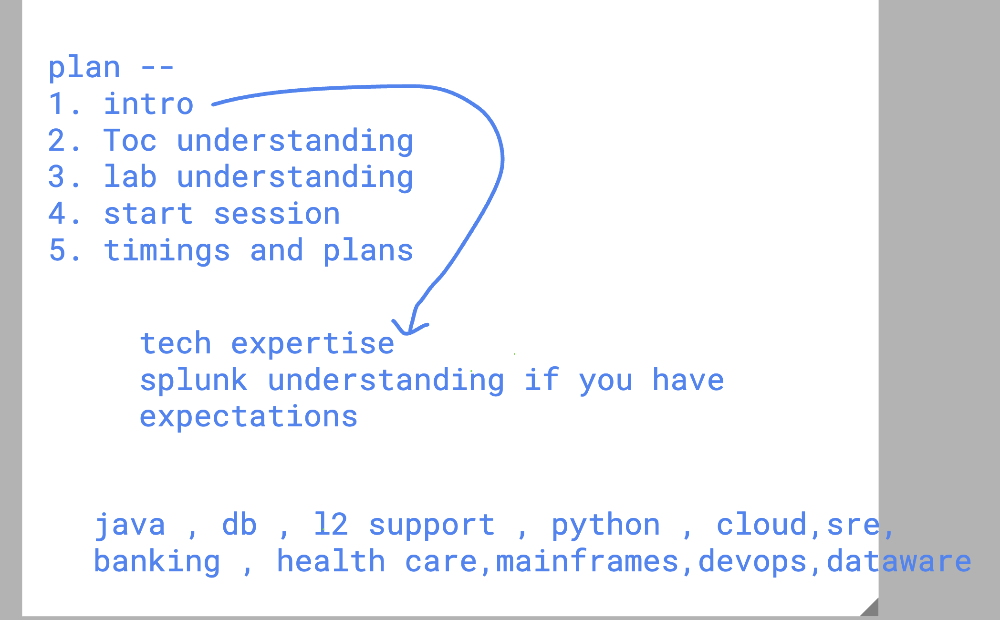
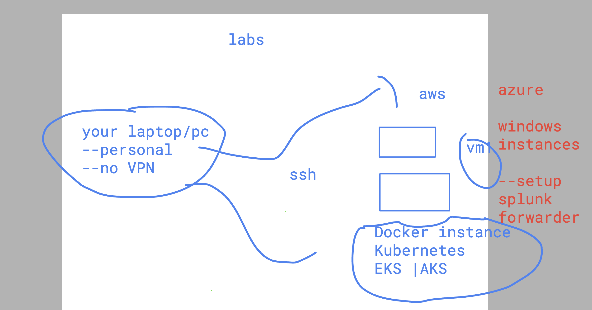
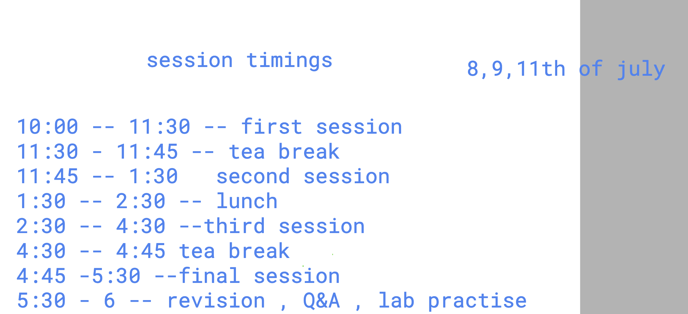
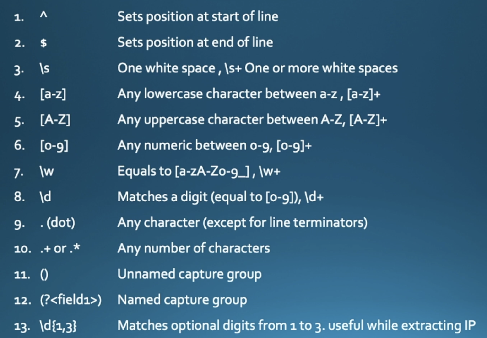

## Participants tech backgroud 



### labs understanding 




### timings session splunk



### Regex token & keywords 



## giving a name to group 

```
^(?<myclientIP>\d{1,3}\.\d{1,3}\.\d{1,3}\.\d{1,3})
```

### using regex in splunk  SPL 

```
index="main" host="ip-172-31-93-203.ec2.internal" | regex _raw="\b(400|404|408|402)\b" | stats count by clientip | where count < 5
```

### checking client IP with Rex 

```
index="main" host="ip-172-31-93-203.ec2.internal" (status=404 OR status=400 OR status=408) | rex field=_raw "^(?<myclientIP>\d{1,3}\.\d{1,3}\.\d{1,3}\.\d{1,3})" | stats count by myclientIP | rename count as "http_400_range_events" | sort - http_400_range_events
```

### another way 

```
index="main" host="ip-172-31-95-77.ec2.internal" | rex field=_raw "^(?P<myclientsIP>\d+\.\d+\.\d+\.\d+)" | stats count by myclientsIP
```

### matching more specific data 

```
index="main" host="ip-172-31-93-203.ec2.internal" (status=404 OR status=400 OR status=408)
| rex field=_raw "^(?<myclientIP>\d{1,3}\.\d{1,3}\.\d{1,3}\.\d{1,3}) - - \[.*\] \"GET (?<page>.*?) HTTP/\d\.\d\""
| stats count by myclientIP, page
```

## Understanding splunk users and Reports


## default splunk forwarder details location 

```
cat  /opt/splunkforwarder/etc/apps/search/local/inputs.conf 
[monitor:///var/log/httpd]
disabled = false
```

### adding more monitor using file 

```
cat  /opt/splunkforwarder/etc/apps/search/local/inputs.conf 
[monitor:///var/log/httpd]
disabled = false
[root@ip-172-31-93-203 etc]# nano   /opt/splunkforwarder/etc/apps/search/local/inputs.conf 
[root@ip-172-31-93-203 etc]# cat  /opt/splunkforwarder/etc/apps/search/local/inputs.conf 
[monitor:///var/log/httpd]
disabled = false


monitor:///var/log/secure]
disabled = false
[root@ip-172-31-93-203 etc]# /opt/splunkforwarder/bin/splunk  restart
Warning: Attempting to revert the SPLUNK_HOME ownership
Warning: Executing "chown -R splunkfwd:splunkfwd /opt/splunkforwarder"
Stopping splunkd...
Shutting down.  Please wait, as this may take a few minutes.
                                                           [  OK  ]
Stopping splunk helpers...
                                                           [  OK  ]
Done.

```
### OR 

```
131  /opt/splunkforwarder/bin/splunk  add monitor   /var/log/secure
  132  /opt/splunkforwarder/bin/splunk restart
```


