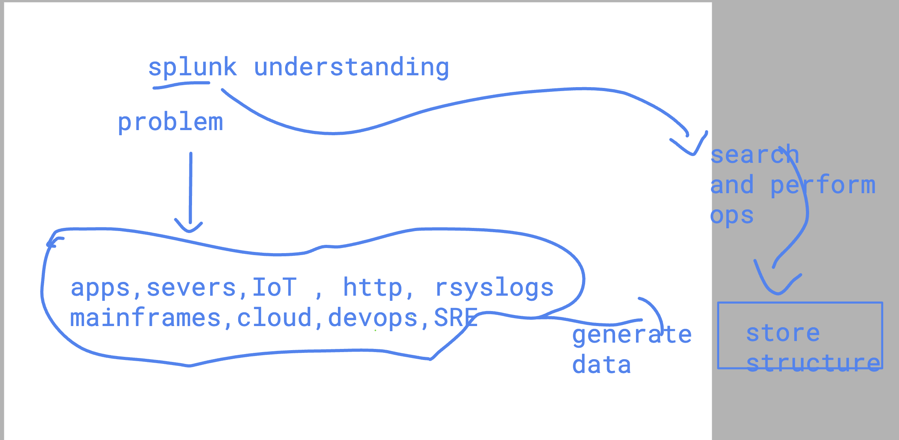
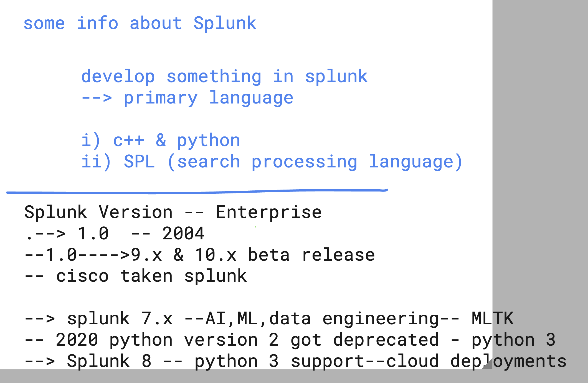
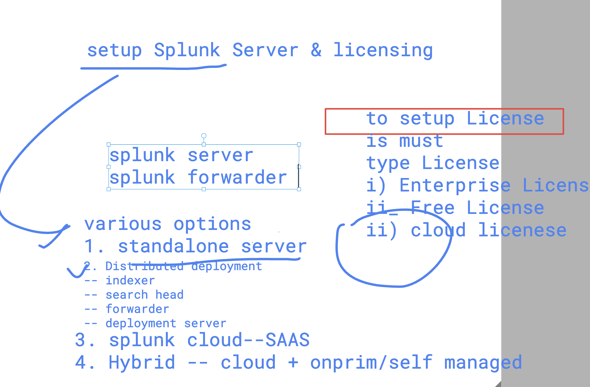
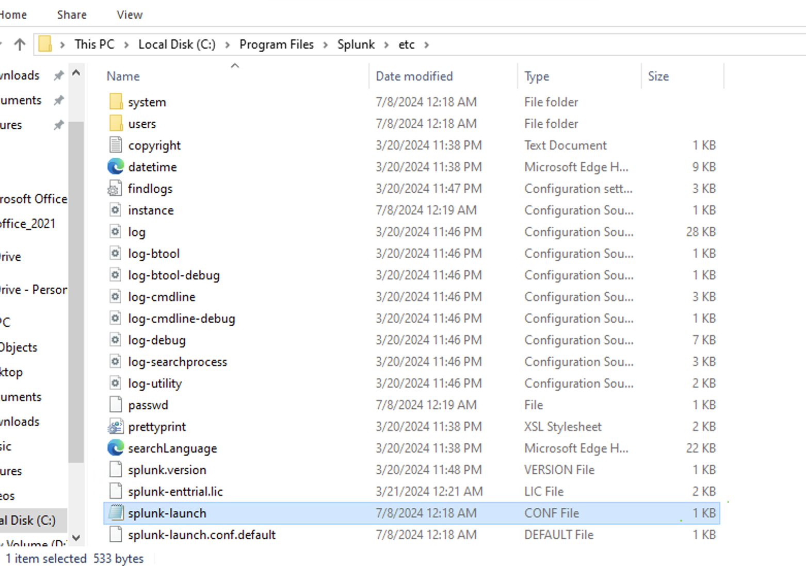
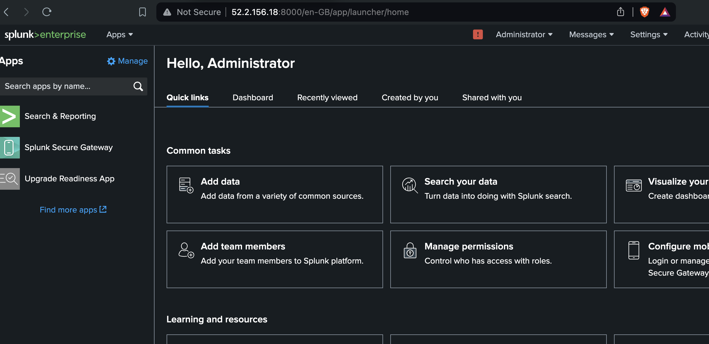
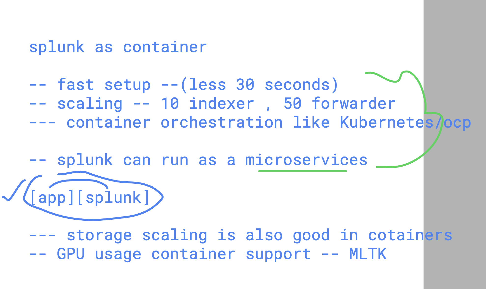

# splunk tech stack 


### problem solved by Splunk 



### splunk info 




## splunk components 

### search head 


### forwarder and Indexer 


## a Visual look 


### setup and Licensing 




### Installation of splunk Enterprise server with Free license 

### On linux Redhat platform 

```
[ec2-user@ip-172-31-60-129 ~]$ sudo -i
[root@ip-172-31-60-129 ~]# whoami
root

```

### download splunk enterserver software 

```
wget -O splunk-9.2.2-d76edf6f0a15.x86_64.rpm "https://download.splunk.com/products/splunk/releases/9.2.2/linux/splunk-9.2.2-d76edf6f0a15.x86_64.rpm"


====>>

--2024-07-08 07:01:24--  https://download.splunk.com/products/splunk/releases/9.2.2/linux/splunk-9.2.2-d76edf6f0a15.x86_64.rpm
Resolving download.splunk.com (download.splunk.com)... 18.154.227.97, 18.154.227.12, 18.154.227.35, ...
Connecting to download.splunk.com (download.splunk.com)|18.154.227.97|:443... connected.
HTTP request sent, awaiting response... 200 OK
Length: 717684718 (684M) [binary/octet-stream]
Saving to: 'splunk-9.2.2-d76edf6f0a15.x86_64.rpm'

100%[=====================================================================================================>] 717,684,718 47.2MB/s   in 10s    

2024-07-08 07:01:34 (68.2 MB/s) - 'splunk-9.2.2-d76edf6f0a15.x86_64.rpm' saved [717684718/717684718]

===>>
[root@ip-172-31-60-129 ~]# ls
splunk-9.2.2-d76edf6f0a15.x86_64.rpm

```

### installing 

```
 rpm -ivh  splunk-9.2.2-d76edf6f0a15.x86_64.rpm 
warning: splunk-9.2.2-d76edf6f0a15.x86_64.rpm: Header V4 RSA/SHA256 Signature, key ID b3cd4420: NOKEY
Preparing...                          ################################# [100%]
Updating / installing...
   1:splunk-9.2.2-d76edf6f0a15        ################################# [100%]
complete

```

### verify 

```
rpm -qa | grep splunk
splunk-9.2.2-d76edf6f0a15.x86_64

OR 

rpm -q splunk 

splunk-9.2.2-d76edf6f0a15.x86_64


```

### Understanding configuration files of splunk server

```
cd  /opt/splunk/
[root@ip-172-31-60-129 splunk]# ls
LICENSE.txt        cmake          ftr      license-eula.txt  quarantined_files                                    swidtag
README-splunk.txt  copyright.txt  include  openssl           share
bin                etc            lib      opt               splunk-9.2.2-d76edf6f0a15-linux-2.6-x86_64-manifest


```

### configuration files 

```
/opt/splunk/

 cd  etc/
[root@ip-172-31-60-129 etc]# ls
anonymizer     deployment-apps      log-btool.cfg          log-utility.cfg  myinstall        searchLanguage.xml          splunk.version
apps           disabled-apps        log-cmdline-debug.cfg  log.cfg          openldap         shcluster                   system
auth           findlogs.ini         log-cmdline.cfg        manager-apps     packages         splunk-enttrial.lic         users
copyright.txt  init.d               log-debug.cfg          master-apps      packagetype      splunk-launch.conf
datetime.xml   log-btool-debug.cfg  log-searchprocess.cfg  modules          prettyprint.xsl  splunk-launch.conf.default


[root@ip-172-31-60-129 etc]# 

===>> verify splunk version 

cat  splunk.version 
VERSION=9.2.2
BUILD=d76edf6f0a15
PRODUCT=splunk
PLATFORM=Linux-x86_64


====> splunk main confi file is 

splunk-launch.conf


```

### a visual of splunk on Windows 



### all Splunk bin commands are available at  bin directory 

```
 pwd
/opt/splunk/etc
[root@ip-172-31-60-129 etc]# cd  ..

[root@ip-172-31-60-129 splunk]# ls
LICENSE.txt        cmake          ftr      license-eula.txt  quarantined_files                                    swidtag
README-splunk.txt  copyright.txt  include  openssl           share
bin                etc            lib      opt               splunk-9.2.2-d76edf6f0a15-linux-2.6-x86_64-manifest


[root@ip-172-31-60-129 splunk]# ls  bin/
2to3-3.7                    genSignedServerCert.py         node                  pydoc3.7                        slim
ColdStorageArchiver.py      genSignedServerCert.sh         openssl               python                          spl-lang-server-sockets
ColdStorageArchiver_GCP.py  genWebCert.py                  parse_xml_buckets.py  python3                         spl2-orchestrator
S3benchmark                 genWebCert.sh                  pcre2-config          python3.7                       splunk
bloom                       idle3                          pcregextest           python3.7m                      splunk-optimize
bottle.py                   idle3.7                        pid_check.sh          pyvenv                          splunk-optimize-lex
btool                       importtool         
```

### starting splunk with license acceptance 

```
/opt/splunk/bin/splunk  start  --accept-license


This appears to be your first time running this version of Splunk.

Splunk software must create an administrator account during startup. Otherwise, you cannot log in.
Create credentials for the administrator account.
Characters do not appear on the screen when you type in credentials.

Please enter an administrator username: ashuadmin
Password must contain at least:
   * 8 total printable ASCII character(s).
Please enter a new password: 
Please confirm new password: 
Copying '/opt/splunk/etc/openldap/ldap.conf.default' to '/opt/splunk/etc/openldap/ldap.conf'.
Generating RSA private key, 2048 bit long modulu
```


### Now try to access splunk management console 



### splunk IP:8000 -- http://IP:8000 

### stopping and starting splunk service 

```
 /opt/splunk/bin/splunk  stop
Stopping splunkd...
Shutting down.  Please wait, as this may take a few minutes.
..                                                         [  OK  ]
Stopping splunk helpers...
                                                           [  OK  ]
Done.


[root@ip-172-31-60-129 splunk]# /opt/splunk/bin/splunk  start

Splunk> The Notorious B.I.G. D.A.T.A.

Checking prerequisites...
	Checking http port [8000]: open
	Checking mgmt port [8089]: open
	Checking appserver port [127.0.0.1:8065]: open

```

### splunk verify port details 

```
netstat -nlpt
Active Internet connections (only servers)
Proto Recv-Q Send-Q Local Address           Foreign Address         State       PID/Program name    
tcp        0      0 0.0.0.0:111             0.0.0.0:*               LISTEN      2783/rpcbind        
tcp        0      0 0.0.0.0:22              0.0.0.0:*               LISTEN      3410/sshd           
tcp        0      0 0.0.0.0:8089            0.0.0.0:*               LISTEN      2823/splunkd        
tcp        0      0 127.0.0.1:25            0.0.0.0:*               LISTEN      3226/master         
tcp        0      0 0.0.0.0:8191            0.0.0.0:*               LISTEN      3053/mongod         
tcp        0      0 0.0.0.0:8000            0.0.0.0:*               LISTEN      2823/splunkd        
tcp        0      0 127.0.0.1:8065          0.0.0.0:*               LISTEN      3181/python3.7      
tcp6       0      0 :::111                  :::*                    LISTEN      2783/rpcbind        
tcp6       0      0 :::22                   :::*                    LISTEN      3410/sshd    
```

### to launch splunk server as docker contaienr 




### make sure you have docker engine installed 

```
yum install docker -y  

 systemctl enable --now docker 
```

### lets creating docker container for splunk enterprise server 

```
docker  run  -itd --name ashusplunk  -p  1234:8000  -e "SPLUNK_START_ARGS=--accept-license" -e "SPLUNK_PASSWORD=Redhat@12345"  splunk/splunk:latest
```

### checking container status

```
docker  ps
CONTAINER ID   IMAGE                  COMMAND                  CREATED         STATUS                            PORTS                                                                                              NAMES
f4f046632b0b   splunk/splunk:latest   "/sbin/entrypoint.sh…"   9 seconds ago   Up 3 seconds (health: starting)   8065/tcp, 8088-8089/tcp, 8191/tcp, 9887/tcp, 9997/tcp, 0.0.0.0:1234->8000/tcp, :::1234->8000/tcp   ashusplunk
```

