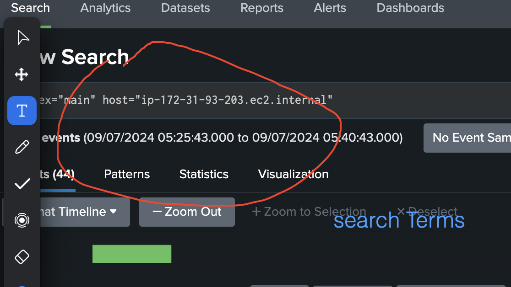
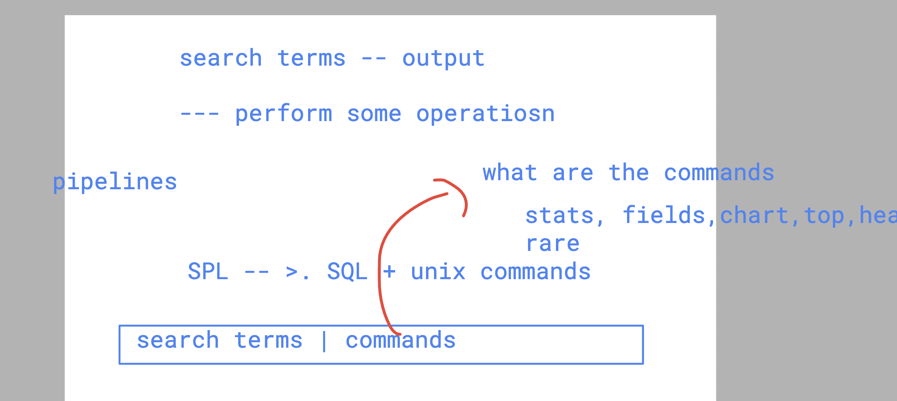

## labs verification 

### httpd app status 

```
systemctl status httpd

● httpd.service - The Apache HTTP Server
   Loaded: loaded (/usr/lib/systemd/system/httpd.service; enabled; vendor preset: disabled)
   Active: active (running) since Tue 2024-07-09 04:52:40 UTC; 34s ago
     Docs: man:httpd.service(8)
 Main PID: 3037 (httpd)
   Status: "Total requests: 0; Idle/Busy workers 100/0;Requests/sec: 0; Bytes served/sec:   0 B/sec"
   Memory: 13.6M
   CGroup: /system.slice/httpd.service
           ├─3037 /usr/sbin/httpd -DFOREGROUND
           ├─3075 /usr/sbin/httpd -DFOREGROUND
```

### splunk forwarder status 

```
/opt/splunkforwarder/bin/splunk  status

Warning: Attempting to revert the SPLUNK_HOME ownership
Warning: Executing "chown -R splunkfwd:splunkfwd /opt/splunkforwarder"
splunkd is running (PID: 3256).
splunk helpers are running (PIDs: 3338).
```

## Doing search operation in SPL of search head 

### searching ops 

```
index=*
index="main" host="ip-172-31-93-203.ec2.internal"

```

### search terms 




### uNderstanding SPL wayout 



### stats

```
index="main" host="ip-172-31-93-203.ec2.internal" | stats count by clientip
```
### using OR operator 

```
index="main" OR index="weblogs"  | stats count by clientip
```

### using stats with where 

```
index="main" host="ip-172-31-93-203.ec2.internal"| stats count by clientip | where count > 20
```

