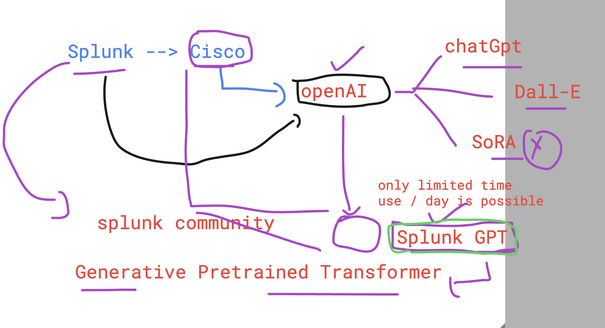

# Splunk With GenAI and GPT models 



### verify forwarder 

```
/opt/splunkforwarder/bin/splunk status

Warning: Attempting to revert the SPLUNK_HOME ownership
Warning: Executing "chown -R splunkfwd:splunkfwd /opt/splunkforwarder"
splunkd is running (PID: 3276).
splunk helpers are running (PIDs: 3345).

```

### verify httpd service 

```
systemctl status httpd 
● httpd.service - The Apache HTTP Server
   Loaded: loaded (/usr/lib/systemd/system/httpd.service; enabled; vendor preset: disabled)
   Active: active (running) since Thu 2024-07-11 02:27:35 UTC; 2h 23min ago
     Docs: man:httpd.service(8)
 Main PID: 3047 (httpd)
   Status: "Total requests: 14; Idle/Busy workers 100/0;Requests/sec: 0.00163; Bytes served/sec:   4 B/sec"
   Memory: 15.1M
   CGroup: /system.slice/httpd.service
           ├─3047 /usr/sbin/httpd -DFOREGROUND
           ├─3085 /usr/sbin/httpd -DFOREGROUND
           ├─3087 /usr/sbin/httpd -DFOREGROUND
```

### verify forwarder input config file 

```
/opt/splunkforwarder/bin/splunk list monitor
Warning: Attempting to revert the SPLUNK_HOME ownership
Warning: Executing "chown -R splunkfwd:splunkfwd /opt/splunkforwarder"
Your session is invalid.  Please login.
Splunk username: deepthidarisi
Password: 
Monitored Directories:

```

### splunk forwarder monitor input file 

```
cd  /opt/splunkforwarder/etc/apps/search/local
[root@ip-172-31-93-203 local]# ls
inputs.conf
[root@ip-172-31-93-203 local]# cat inputs.conf 
[monitor:///var/log/httpd]
disabled = false


[monitor:///var/log/secure]
disabled = false


```