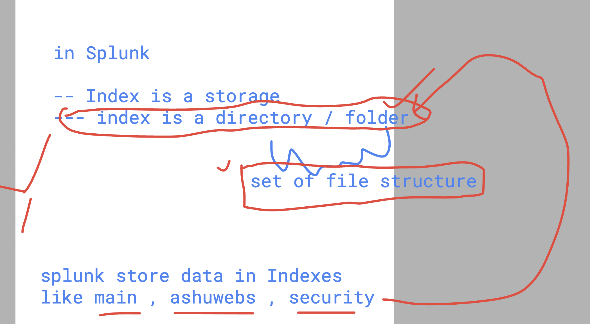

# Splunk With GenAI and GPT models 


### verify forwarder 

```
/opt/splunkforwarder/bin/splunk status

Warning: Attempting to revert the SPLUNK_HOME ownership
Warning: Executing "chown -R splunkfwd:splunkfwd /opt/splunkforwarder"
splunkd is running (PID: 3276).
splunk helpers are running (PIDs: 3345).

```

### verify httpd service 

```
systemctl status httpd 
● httpd.service - The Apache HTTP Server
   Loaded: loaded (/usr/lib/systemd/system/httpd.service; enabled; vendor preset: disabled)
   Active: active (running) since Thu 2024-07-11 02:27:35 UTC; 2h 23min ago
     Docs: man:httpd.service(8)
 Main PID: 3047 (httpd)
   Status: "Total requests: 14; Idle/Busy workers 100/0;Requests/sec: 0.00163; Bytes served/sec:   4 B/sec"
   Memory: 15.1M
   CGroup: /system.slice/httpd.service
           ├─3047 /usr/sbin/httpd -DFOREGROUND
           ├─3085 /usr/sbin/httpd -DFOREGROUND
           ├─3087 /usr/sbin/httpd -DFOREGROUND
```

### verify forwarder input config file 

```
/opt/splunkforwarder/bin/splunk list monitor
Warning: Attempting to revert the SPLUNK_HOME ownership
Warning: Executing "chown -R splunkfwd:splunkfwd /opt/splunkforwarder"
Your session is invalid.  Please login.
Splunk username: deepthidarisi
Password: 
Monitored Directories:

```

### splunk forwarder monitor input file 

```
cd  /opt/splunkforwarder/etc/apps/search/local
[root@ip-172-31-93-203 local]# ls
inputs.conf
[root@ip-172-31-93-203 local]# cat inputs.conf 
[monitor:///var/log/httpd]
disabled = false


[monitor:///var/log/secure]
disabled = false


```

### splunk dashboard is all about python libs -- 


### task to  complete dashbaord creation 


### alerts and notifications in Splunk Enterprise engine 


## Datastore and backup in Splunk 

### understading Indexer process 


### more closure look 


### understnading index in general 



### bucket location 

```
root@ip-172-31-60-129 splunk]# pwd
/opt/splunk/var/lib/splunk
[root@ip-172-31-60-129 splunk]# ls
audit           _configtracker.dat  _dsphonehome  _internal.dat       kvstore       _metrics_rollup    security.dat    weblogs
_audit.dat      defaultdb           fishbucket    _internaldb         main.dat      modinputs          summarydb       weblogs.dat
authDb          _dsappevent         hashDb        _introspection      _metrics      persistentstorage  _telemetry
_configtracker  _dsclient           historydb     _introspection.dat  _metrics.dat  security           _telemetry.dat
[root@ip-172-31-60-129 splunk]# cd weblogs/
[root@ip-172-31-60-129 weblogs]# ls
colddb  datamodel_summary  db  thaweddb
[root@ip-172-31-60-129 weblogs]# cd db/
[root@ip-172-31-60-129 db]# ls
CreationTime  db_1617819736_1617214936_0  GlobalMetaData
[root@ip-172-31-60-129 db]# cd ..
[root@ip-172-31-60-129 weblogs]# ls
colddb  datamodel_summary  db  thaweddb
[root@ip-172-31-60-129 weblogs]# cd ..
[root@ip-172-31-60-129 splunk]# ls
audit           _configtracker.dat  _dsphonehome  _internal.dat       kvstore       _metrics_rollup    security.dat    weblogs
_audit.dat      defaultdb           fishbucket    _internaldb         main.dat      modinputs          summarydb       weblogs.dat
authDb          _dsappevent         hashDb        _introspection      _metrics      persistentstorage  _telemetry
_configtracker  _dsclient           historydb     _introspection.dat  _metrics.dat  security           _telemetry.dat
[root@ip-172-31-60-129 splunk]# du -sh weblogs
6.2M    weblogs
[root@ip-172-31-60-129 splunk]# 

```

## setup of splunk server on Kubernetes 

### on kuberneres client 


```

kubectl   version --client 
Client Version: v1.28.8-eks-ae9a62a
Kustomize Version: v5.0.4-0.20230601165947-6ce0bf390ce3
[ec2-user@ip-172-31-82-122 ~]$ 
[ec2-user@ip-172-31-82-122 ~]$ 


[ec2-user@ip-172-31-82-122 ~]$ kubectl    get  nodes
NAME                                STATUS   ROLES   AGE    VERSION
aks-agentpool-84774012-vmss000000   Ready    agent   7h5m   v1.28.9
aks-agentpool-84774012-vmss000001   Ready    agent   7h5m   v1.28.9
[ec2-user@ip-172-31-82-122 ~]$ 

```

## stesp 

### creating namespace 

```
kubectl   get  ns
NAME              STATUS   AGE
default           Active   7h12m
kube-node-lease   Active   7h12m
kube-public       Active   7h12m
kube-system       Active   7h12m
[ec2-user@ip-172-31-82-122 ~]$ 
[ec2-user@ip-172-31-82-122 ~]$ kubectl    create   ns   ashu-splunk 
namespace/ashu-splunk created
[ec2-user@ip-172-31-82-122 ~]$ kubectl   get  ns
NAME              STATUS   AGE
ashu-splunk       Active   2s
default           Active   7h12m
kube-node-lease   Active   7h12m
kube-public       Active   7h12m
kube-system       Active   7h12m
[ec2-user@ip-172-31-82-122 ~]$ 

```

### creating deployment file 

```
kubectl   create  deployment  ashu-spmaster  --image=splunk/splunk:latest --port 8000 --namespace ashu-splunk  --dry-run=c
lient -o yaml >ashu.yaml
```

### modify splunk manifest to update port and env 

```
apiVersion: apps/v1
kind: Deployment
metadata:
  creationTimestamp: null
  labels:
    app: ashu-spmaster
  name: ashu-spmaster
  namespace: ashu-splunk
spec:
  replicas: 1
  selector:
    matchLabels:
      app: ashu-spmaster
  strategy: {}
  template:
    metadata:
      creationTimestamp: null
      labels:
        app: ashu-spmaster
    spec:
      containers:
      - image: splunk/splunk:latest
        name: splunk
        env: 
        - name: SPLUNK_START_ARGS
          value: --accept-license
        - name: SPLUNK_PASSWORD
          value: Redhat@12345
        ports:
        - containerPort: 8000 # console 
        - containerPort: 9997 # receiver 
        - containerPort: 8089 # splunk API 
        - containerPort: 8088 # splunk connection 
        resources: {}
status: {}
```

### creating deploying 

```
ec2-user@ip-172-31-82-122 ~]$ kubectl   create  -f  ashu.yaml 
deployment.apps/ashu-spmaster created
[ec2-user@ip-172-31-82-122 ~]$ 
[ec2-user@ip-172-31-82-122 ~]$ kubectl   get  deploy -n ashu-splunk 
NAME            READY   UP-TO-DATE   AVAILABLE   AGE
ashu-spmaster   0/1     1            0           7s
[ec2-user@ip-172-31-82-122 ~]$ 
[ec2-user@ip-172-31-82-122 ~]$ kubectl   get  pod -n ashu-splunk 
NAME                            READY   STATUS              RESTARTS   AGE
ashu-spmaster-7866cccf4-sbfjk   0/1     ContainerCreating   0          14s
[ec2-user@ip-172-31-82-122 ~]$ 
```
### creating LoadBalancer service to expose splunk webUI 

```
 kubectl   get  deploy -n ashu-splunk 
NAME            READY   UP-TO-DATE   AVAILABLE   AGE
ashu-spmaster   1/1     1            1           3m4s
[ec2-user@ip-172-31-82-122 ~]$ 


[ec2-user@ip-172-31-82-122 ~]$ kubectl  expose deployment  ashu-spmaster  --type LoadBalancer --port 80 --target-port 8000 --name ashulb --namespace ashu-splunk 
service/ashulb exposed
[ec2-user@ip-172-31-82-122 ~]$ 
```


